# Azure Container Registry (ACR) - CI with Azure DevOps

---

## Overview
Azure Container Registry is a managed [Docker registry](https://docs.docker.com/registry/) service based on the open-source Docker Registry 2.0. Create and maintain Azure container registries to store and manage your private [Docker container](https://www.docker.com/what-docker) images.

You start your learning journey form Docker registry because every service that uses Docker container uses Docker registry at the end.

### Objectives
In this hands-on lab, you will learn how to:
* Create a Build Pipeline on Azure DevOps
* Push and pull Docker container images to Azure Container Registry

## Exercises
This hands-on lab includes the following tasks:
* [Exercise 1: Create a Build Pipeline on Azure DevOps](#exercise1)
* [Exercise 2: Push and pull Docker container images to Azure Container Registry](#exercise2)

Estimated time to complete this lab: **30** minutes.

### Exercise 1: Create a Build Pipeline on Azure DevOps
Deploying an application reliably and efficiently is one of the many reasons organizations start using containers. Although containers provide a way to deliver value to end-users quickly, you need a way to continuously deliver that value. Using Continuous Integration and Continuous Delivery/Deployment (CI/CD) in Azure DevOps will solve the need to ship quickly to end-users in an automated fashion.

#### Task 1: Initiating the Pipeline
To start the process of the creating the pipeline to create a Docker image, you will need to initialize the pipeline by starting the prerequisites like linking a GitHub profile to the pipeline so the code is accessible.

Open up a web browser and log into Azure DevOps to start creating the pipeline. As you can see in the screenshot below, my organization name is adminturneddevops but the organization you see will be different.

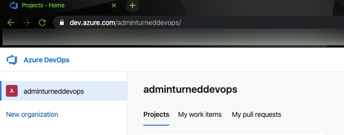

#### Task 2: Choose a project 

For the pipeline you will be creating to reside in within the Azure DevOps organization.

#### Task 3: Start creating the new pipeline.

Once in the project, go to Pipelines and click Pipelines to start creating the new pipeline.

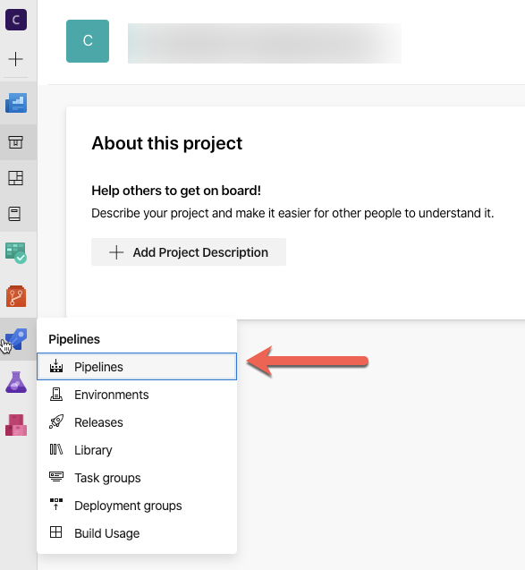

Click the blue New pipeline button to start the creation of a new pipeline.

Choose the classic option by clicking the Use the classic editor button to not use YAML.

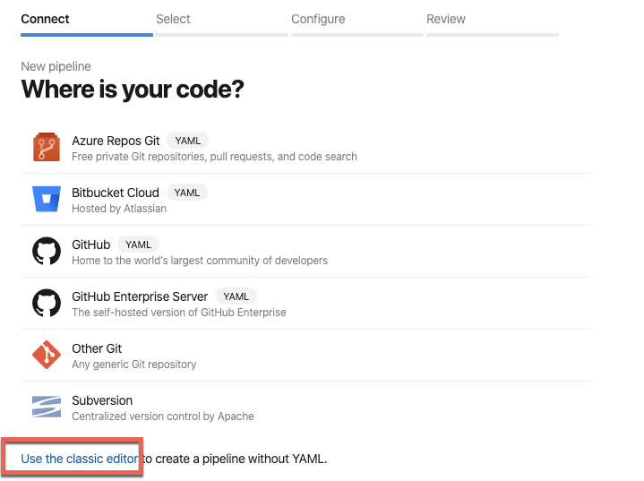

Use the default value for the Azure Repos Git, then click the Continue button.

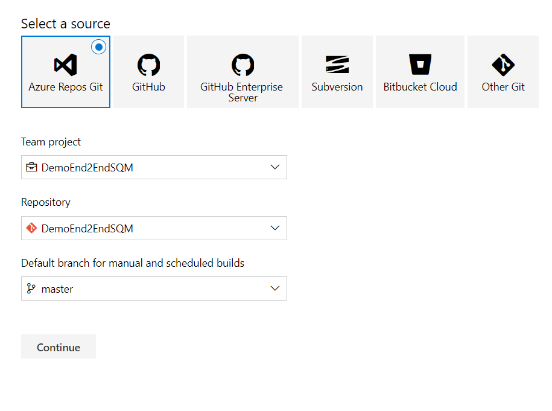

[Scroll to Top](#exercises)

### Exercise 2: Push and pull Docker container images to Azure Container Registry

Select an `Empty Job`. Our final Pipeline should look like the following one, our agent definition should be `ubuntu-18.04`. We are going to emulate all of the steps that we followed in our previous terminal-console activity.

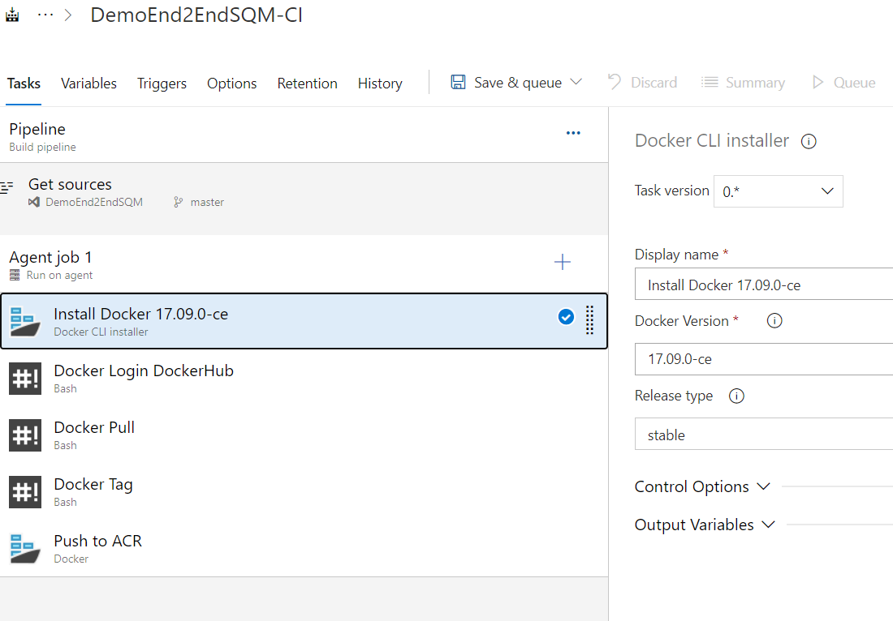

#### Task 1: Add the Docker CLI Installer Task
It should be configured as follows

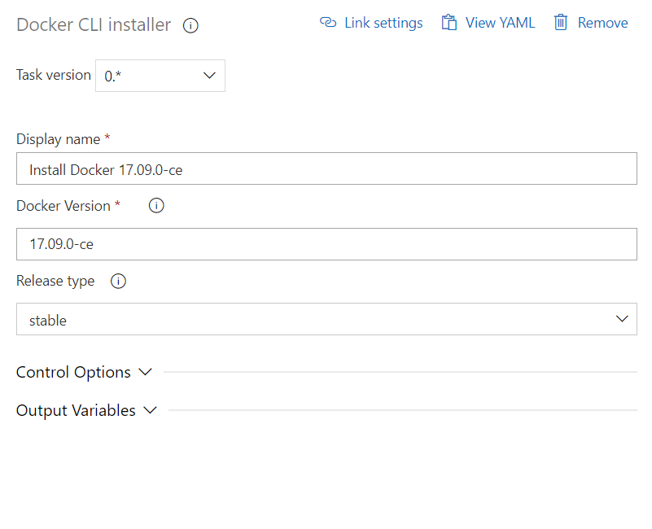

#### Task 2: Add the Bash Task - Docker Login
We are going to login with our account in dockerhub. It should be configured as follows

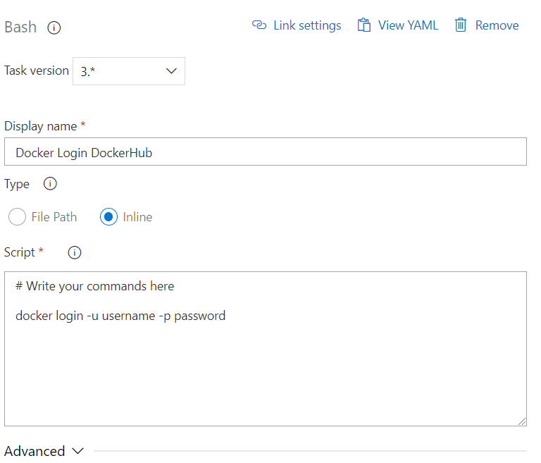

#### Task 3: Add another Bash Task - Docker Pull
We are going to pull the image from dockerhub. It should be configured as follows

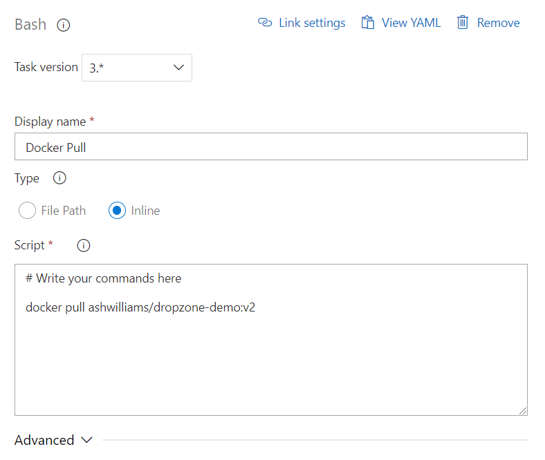

#### Task 4: Add anoooother Bash Task - Docker Tag
We are going to tag the image from dockerhub. It should be configured as follows

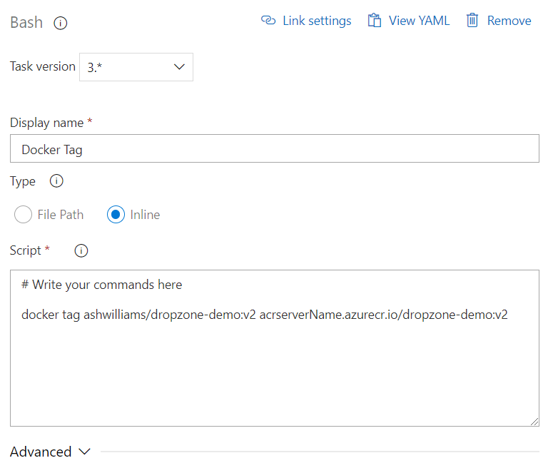

#### Task 5: Add a Docker Task - Push to ACR
We are going push, the tagged image from the running agent, to our ACR instance. It should be configured as follows

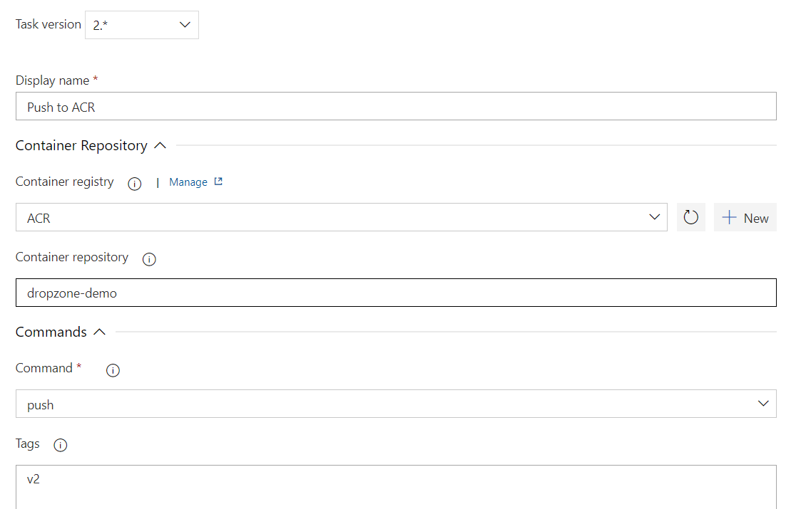

#### Task 6: Save and Run the Pipeline
We are going to save the pipeline, clicking on the Save button. Once it's saved, we are going to return to the Pipelines menu and click on our newly created pipeline. Then click on the "Run Pipeline" button.

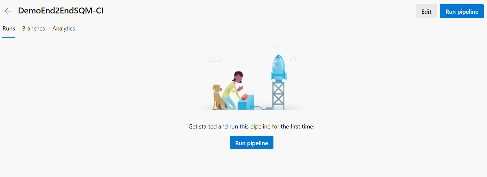

Check the results.

[Scroll to Top](#exercises)

## Summary
In this hands-on lab you learned how to:
* Create a Build Pipeline on Azure DevOps
* Push and pull Docker container images to Azure Container Registry

## References
To learn more, follow below references.
* [Azure DevOps product page](https://azure.microsoft.com/es-es/overview/what-is-devops/)
* [Azure Container Registry documentation](https://docs.microsoft.com/en-us/azure/container-registry/)
